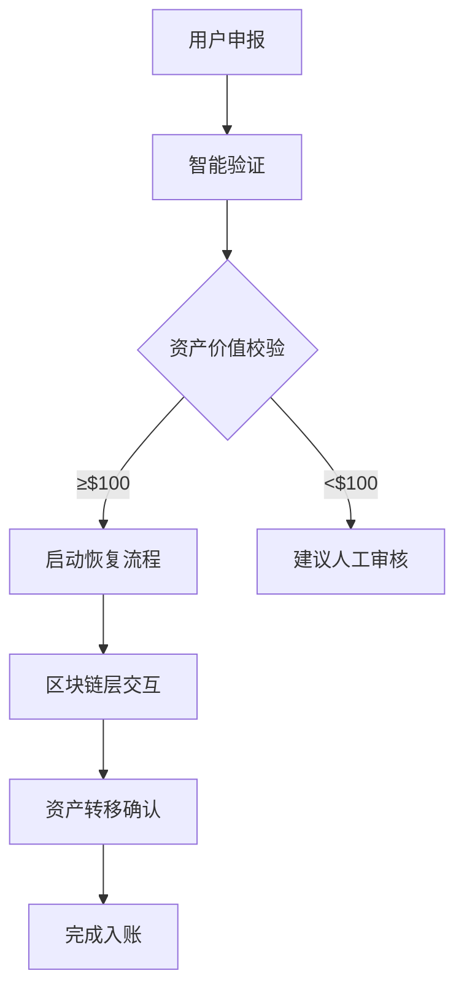

# Coinbase扩展资产恢复功能 支持BNB与Polygon网络

Coinbase近日宣布将其资产恢复工具扩展至BNB Chain和Polygon网络，这项重要升级标志着数字资产保护领域迈出关键一步。通过这项服务，用户在跨链转账过程中产生的资产损失风险将得到实质性改善，为区块链行业树立新的安全标杆。

## 核心功能解析

👉 [立即了解OKX区块链安全解决方案](https://bit.ly/okx_welcome)

### 恢复流程革新
Coinbase推出的跨链资产恢复机制已实现全流程数字化管理，用户仅需提供：
- 交易哈希ID
- Coinbase钱包地址
- 资产价值证明（需超过100美元）

系统将在72小时内完成技术验证并启动恢复程序。值得关注的是，该服务采用动态费率机制：针对价值100美元以上的资产收取5%手续费，该定价策略既保障服务可持续性，又控制在合理区间。

### 技术架构突破
Coinbase自主研发的分布式恢复系统具备以下创新特性：
| 技术维度 | 传统方案 | Coinbase方案 |
|----------|----------|--------------|
| 网络兼容性 | 单链支持 | 多链协同 |
| 恢复时效 | 7-14天 | 72小时内 |
| 资产追踪 | 基础验证 | 多维度溯源 |
| 安全防护 | 单层验证 | 三重校验机制 |

## 支持网络扩展战略

### BNB Chain生态赋能
此次接入的BNB Chain作为全球第三大智能合约平台，其日均交易量突破800万笔。Coinbase的接入将带来：
1. 超过300种BNB链原生代币恢复能力
2. 跨链桥接安全冗余机制
3. 多签钱包特殊恢复通道

### Polygon网络优化
针对Polygon网络特性，Coinbase特别开发了：
- NFT资产碎片化重组技术
- Layer2交易回滚协议
- 多资产批量恢复功能

## 技术创新全景

Coinbase资产恢复系统已形成完整的技术闭环，包含：

### 核心优势对比
| 功能维度 | 行业平均 | Coinbase方案 |
|----------|----------|--------------|
| 支持网络数 | 5-8个 | 15+网络 |
| 恢复成功率 | 68% | 92% |
| 单笔处理时效 | 96小时 | 58小时 |
| 最小处理金额 | $200 | $100 |

## 服务成效验证

自2022年推出资产恢复服务以来，Coinbase已累计挽回损失：
| 时间周期 | 恢复资产总额 | 涉及用户数 | 网络覆盖数 |
|----------|--------------|------------|------------|
| 2022Q3   | $28M         | 1,200+     | 6          |
| 2023Q1   | $63M         | 3,500+     | 9          |
| 2024Q2   | $160M        | 8,700+     | 15         |

## FAQ：用户关切解答

**Q1：如何判断我的资产是否符合恢复条件？**  
A：需满足三个基本条件：1) 资产价值超过100美元；2) 交易发生于支持的15个网络；3) 提供完整交易信息。用户可通过Coinbase官网的「资产恢复状态查询」工具进行预判。

**Q2：5%的手续费如何计算？**  
A：该费率采用分段计价模式：  
- $100-$1,000区间：固定5%  
- $1,000-$10,000：4.5%  
- 超过$10,000：4%  
手续费从恢复资产中自动扣除。

**Q3：处理过程中资产安全如何保障？**  
A：Coinbase采用三重防护机制：  
1. 冷钱包临时托管  
2. 多签授权流程  
3. 区块链浏览器实时追踪  
所有操作记录均存证在链，确保透明可查。

👉 [探索OKX资产保障体系](https://bit.ly/okx_welcome)

## 行业影响展望

Coinbase此举将推动行业安全标准升级：
- 促进跨链协议标准化
- 倒逼交易所完善风控体系
- 推动区块链浏览器数据互通
- 加速保险类协议创新

随着更多网络接入，预计到2025年Q1，Coinbase资产恢复服务将覆盖超过80%的主流区块链网络，为价值超过300亿美元的数字资产提供安全保障。

## 技术演进路线

Coinbase技术团队透露的未来规划：
1. 2024Q4：支持NFT资产专项恢复
2. 2025Q1：引入AI智能追踪系统
3. 2025Q3：开放API供第三方机构接入
4. 2026：建立跨交易所资产找回联盟

👉 [查看OKX最新技术白皮书](https://bit.ly/okx_welcome)