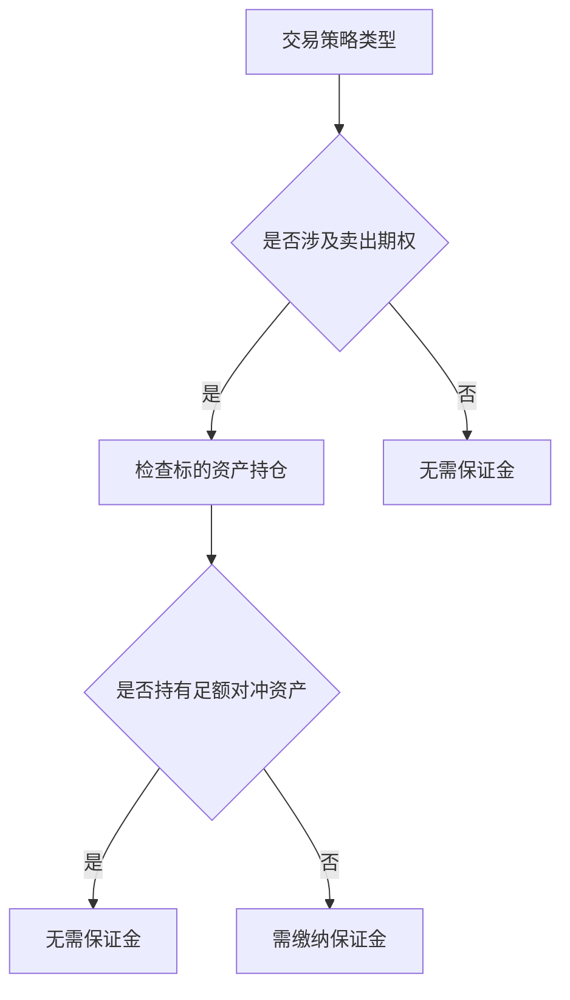

# 期权交易保证金解析：新手必读指南

## 一、期权交易保证金的核心概念

在期权交易中，保证金是投资者向经纪商提供的担保资产，主要用于覆盖卖出期权可能产生的履约风险。当您选择卖出（做空）期权时，必须按监管机构和交易所的规定存入相应比例的现金或有价证券作为履约保障。

**关键知识点：**
- **监管框架**：美国金融业监管局（FINRA）与芝加哥期权交易所（CBOE）共同制定了最低保证金标准
- **经纪商加码**：多数券商会在监管要求基础上增加额外保证金要求
- **豁免情形**：备兑期权（Covered Options）策略无需缴纳保证金

> 📌 实务案例：若投资者持有1000股苹果股票，采用备兑认购策略（Covered Call）卖出看涨期权，因其持有足额标的资产，可豁免保证金要求。

## 二、保证金交易与期权交易的差异对比

| 维度         | 保证金交易                | 期权交易                |
|--------------|---------------------------|-------------------------|
| 资金来源     | 需向券商申请信用账户借款  | 无需借款                |
| 杠杆机制     | 直接放大资产购买力        | 通过权利金实现间接杠杆  |
| 风险特征     | 亏损可能超过初始投资      | 最大损失限于权利金支出  |
| 适用策略     | 股票双向交易              | 多样化策略组合          |

**监管动态**：2025年SEC新规要求券商对保证金账户实施动态风险评估，投资者需特别关注账户维护保证金比例变动。

👉 [选择适合期权交易的优质经纪平台](https://bit.ly/okx_welcome)

## 三、规避保证金要求的三大实战策略

### 1. 备兑策略组合
- **备兑认购**（Covered Call）：持有标的资产+卖出看涨期权
- **备兑认沽**（Covered Put）：做空标的资产+卖出看跌期权

### 2. 借方价差策略
- **垂直价差**：同时买入与卖出相同标的、不同行权价的期权
- **日历价差**：跨不同到期日的期权组合

### 3. 波动率套利策略
- **跨式组合**（Straddle）：同时买入相同行权价的看涨看跌期权
- **宽跨式组合**（Strangle）：不同行权价的期权组合

> ✅ 实务建议：初学者可优先采用Level 1权限允许的买入看涨/看跌策略，既可规避保证金要求，又能获得杠杆收益。

## 四、保证金计算方法论

### 1. 标准公式体系
CBOE推荐的保证金计算模型包含：
- **初始保证金** = Max(期权价值, 标的资产价值×固定比例)
- **维持保证金** = 初始保证金×75%

### 2. 实用工具推荐
- [CBOE保证金计算器](https://www.cboe.com/education/tools/margin-calculator/)（含策略模拟功能）
- 券商专属计算模块（如Interactive Brokers的Margin Wizard）

### 3. 动态调整机制
保证金比例会随以下因素波动：
- 标的资产波动率（VIX指数）
- 市场系统性风险（如美联储政策周期）
- 个股特殊事件（财报季、并购公告）

👉 [掌握专业级保证金管理技巧](https://bit.ly/okx_welcome)

## 五、进阶投资者必知的保证金管理

### 保证金账户优化方案
| 策略类型       | 保证金占用比 | 风险收益特征         |
|----------------|--------------|----------------------|
| 裸卖看涨期权   | 100%         | 高风险高收益         |
| 有担保卖空     | 50%          | 中等风险中等收益     |
| 复式期权组合   | 20-30%       | 风险对冲型收益       |

### 常见问题解答（FAQ）

**Q1：保证金账户与普通账户的根本区别？**
A：保证金账户允许进行信用交易，提供杠杆效应，但需承担追加保证金风险。普通账户仅支持全额交易。

**Q2：保证金比例会实时变动吗？**
A：基础保证金比例由监管机构设定，但券商可根据市场情况动态调整。例如，在重大经济数据发布前可能临时上调5-10%。

**Q3：如何判断是否需要缴纳保证金？**
A：当执行卖出期权策略且未持有足额对冲资产时，即触发保证金要求。买入期权策略通常无需缴纳。

**Q4：保证金账户的利率成本如何计算？**
A：按日计息模式为主，年化利率通常在基准利率（如SOFR）基础上加1-3个百分点。

**Q5：保证金账户能否进行跨市场套利？**
A：是的，但需注意不同市场保证金规则差异。建议采用价差策略控制风险敞口。

## 六、智能交易决策指南

### 保证金使用决策树

### 风险管理黄金法则
1. **分散原则**：单一策略保证金占用不超过账户总资产的15%
2. **流动性管理**：保留至少30%现金应对追加保证金通知
3. **压力测试**：定期模拟极端市场条件下的保证金缺口

👉 [获取实时保证金风险管理工具](https://bit.ly/okx_welcome)

## 七、专业交易者经验分享

**Ben Sturgill的保证金运用策略：**
1. 采用动态保证金分配模型，根据波动率调整各策略仓位
2. 设置自动平仓线，当账户权益跌破保证金要求的120%时触发
3. 通过期权组合构建合成期货头寸，降低保证金占用

> 📈 市场观察：2025年Q2数据显示，采用智能保证金管理的投资者，年化收益率比传统策略高出8-12个百分点。

## 八、监管合规要点

2025年新实施的《证券账户管理新规》对保证金交易提出：
- **投资者适当性**：需完成衍生品交易知识测试（Level 2以上权限）
- **风险揭示**：券商须每月提供保证金账户风险度报告
- **压力测试**：要求券商每季度进行极端市场情景模拟

建议投资者定期：
- 核对账户保证金比例（建议维持在150%以上）
- 关注券商公告的保证金调整通知
- 参与交易所组织的投资者教育课程

通过系统化的保证金管理，投资者既能有效控制风险，又能充分发挥期权策略的杠杆效应。记住，优秀的风险管理永远是持续盈利的关键。