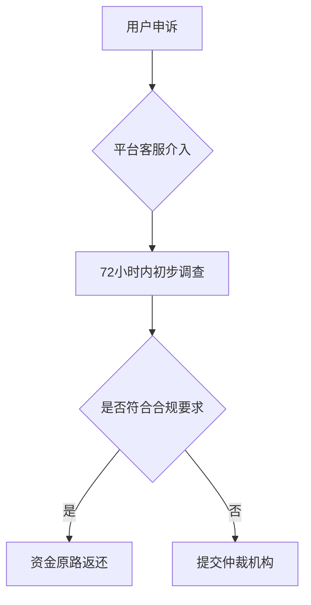

# 欧意提出来钱合法吗？违不违法？

数字货币交易的合规性一直是投资者关注的核心问题。作为全球领先的数字资产交易平台，欧易（OKX）的提币操作是否合法？资金流转是否存在法律风险？本文将从合规框架、操作规范、风险防控三个维度进行深度解析，帮助投资者全面了解数字资产提币的法律边界。

## 一、欧意提币的法律合规性分析

### 1. 平台运营资质的合规基础
欧易作为注册于马耳他、持有多国金融牌照的合规交易平台，其运营框架严格遵循《欧盟反洗钱指令》（AMLD5）、新加坡《支付服务法案》（PSA）等国际标准。平台通过以下三层合规架构保障用户权益：
- **KYC验证体系**：采用生物识别、证件OCR等技术完成用户身份核验
- **资金溯源机制**：建立区块链交易可追溯系统，实现资金流向全链路监控
- **合规审计制度**：定期接受德勤等第三方机构的合规性审查

👉 [深度解析全球合规监管体系](https://bit.ly/okx_welcome)

### 2. 区域性法律差异的影响
数字资产监管呈现显著的地域特征，主要分为三大类型：
| 监管类型 | 代表国家 | 提币限制 |
|---------|----------|----------|
| 牌照准入制 | 美国、日本 | 需对接合规金融机构 |
| 负面清单制 | 新加坡、瑞士 | 单日限额≤50BTC |
| 禁止交易类 | 中国、印度 | 资金出境受阻 |

用户在提币前应查询OECD发布的《数字资产监管地图》，确保操作符合所在地金融监管要求。

## 二、提币操作的合法性判定标准

### 1. 资金来源合法性审查
平台通过AI风险控制系统，对提币资金进行多维度验证：
- **原始资金路径**：追溯至法币入金账户的银行流水记录
- **交易行为分析**：监测是否存在高频异常交易模式
- **黑名单筛查**：实时比对OFAC制裁名单与链上追踪数据

### 2. 操作合规性要点
合法提币需同时满足三项条件：
1. 完成Level-2身份认证（含地址证明与资金来源声明）
2. 单笔转账金额低于反洗钱预警阈值（通常为5BTC）
3. 接收地址通过智能合约安全审计（非暗网钱包等高危地址）

👉 [全球钱包合规性检测指南](https://bit.ly/okx_welcome)

## 三、风险防控机制详解

### 1. 技术层面的保障措施
欧易采用军用级安全架构保护用户资产：
- **冷热钱包隔离**：98%资产存于离线冷钱包，配备量子加密保护
- **多重签名技术**：资金划转需通过3/5分布式签名验证
- **异常行为拦截**：建立基于机器学习的实时风控模型

### 2. 法律救济途径
当用户遭遇提币纠纷时，可启动三级争议解决机制：

## 四、常见问题解答（FAQ）

Q1：完成KYC后资金会被冻结吗？

A：只要资金来源合法且交易行为合规，KYC验证不会导致资金冻结。欧易采用动态风控系统，仅对异常交易实施临时冻结措施。

Q2：提币到非合规钱包有何风险？

A：可能触发反洗钱预警导致资金退回，极端情况下接收地址可能被列入链上黑名单。建议优先使用经审计的合规钱包。

Q3：如何证明资金来源合法性？

A：需提供完整的交易流水、纳税证明、资产归属声明等文件。高净值用户建议提前进行税务合规规划。

👉 [全球合规钱包地址库查询](https://bit.ly/okx_welcome)

## 五、投资者决策指南

在进行数字资产提币前，建议投资者执行五步核查法：
1. 确认接收地址符合当地监管要求
2. 检查近30日交易记录是否存在异常波动
3. 核对KYC资料有效性（证件有效期、地址证明更新）
4. 评估资金用途是否符合反洗钱规定
5. 预留至少3个工作日处理时间应对合规审查

通过建立完善的合规认知体系，投资者可以更安全地参与数字资产交易。建议持续关注国际清算银行（BIS）发布的《加密资产监管框架》更新，及时调整投资策略。